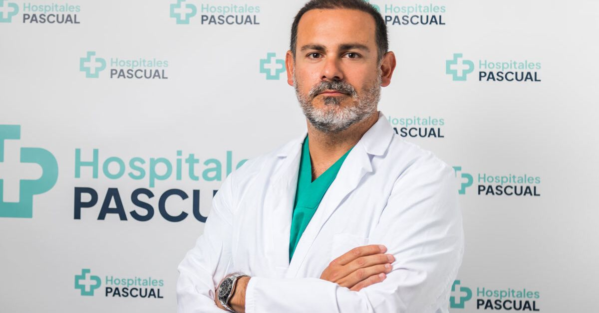

# José Manuel Pascual Espinosa

- **Especialidad:** Traumatología
- **Institución:** Hospital San Rafael, Cádiz
- **Formación:** Grado en Medicina (Universidad de Cádiz); Especialidad en Traumatología (MIR)
- **Experiencia:** 12 años de práctica clínica en Traumatología
- **Subespecialización:** Cirugía ortopédica (prótesis de cadera y rodilla)
- **Participación en investigación:** Sí (proyectos clínicos y publicaciones científicas)
- **Actividades profesionales:** Conferencias, publicaciones, investigación y atención clínica
- **Idiomas:** Español, Inglés
- **Número de colegiado:** 111109765
- **Antecedentes legales:** Sin antecedentes públicos

## Currículum

### Experiencia profesional

- Traumatólogo en el Hospital San Rafael (actualidad). 12 años de experiencia clínica.

### Subespecialización

- Cirugía ortopédica: prótesis de cadera y rodilla.

### Logros académicos

- Licenciado en Medicina y Cirugía.
- Especialista vía MIR en Traumatología y Cirugía Ortopédica.
- Publicaciones y conferencias en revistas y eventos nacionales e internacionales.

### Investigación

- Participación en proyectos clínicos y artículos científicos relacionados con Traumatología.

---