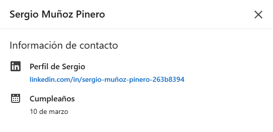

### 🔍 Hallazgos OSINT sobre Sergio Muñoz Pinero

- **Nombre completo**: Sergio Muñoz Pinero
- **Cargo**: Director Administrativo en Hospitales Pascual
- **Experiencia laboral**:
  - Director Administrativo en Hospitales Pascual (mayo 2024 – actualidad)
  - Oficial Administrativo en Hospitales Pascual (enero 2016 – mayo 2024)
  - Asesor en Gestión de Riesgos en Nacar Consultores (febrero 2014 – noviembre 2015)
- **Formación**: Administración y Dirección de Empresas en Universidad de Salamanca
- **Intereses**: Empresas, gestión de riesgos, asistencia sanitaria
- **Conexiones en LinkedIn**: 161 contactos
- **Publicaciones**: No tiene publicaciones aún
- **Ubicación**: Cádiz, Andalucía, España
- **Fecha de nacimiento**: 10 de marzo (aproximadamente 33 años)

### 📌 Posibles ataques de ingeniería social

- **Phishing**: Sergio podría ser un objetivo para un ataque de phishing, especialmente si se le envía un correo electrónico que parezca provenir de la clínica o de un proveedor.
- **Social Engineering**: Su cargo de Director Administrativo lo convierte en una figura clave que podría tener acceso a información sensible.
- **Red de contactos**: Con 165 contactos en LinkedIn, Sergio tiene una red profesional significativa que podría ser utilizada para identificar otros contactos relevantes.

### 📁 Evidencias

- (Linkedin - Sergio Muñoz Pinero)
  
- (información de contacto)
  
